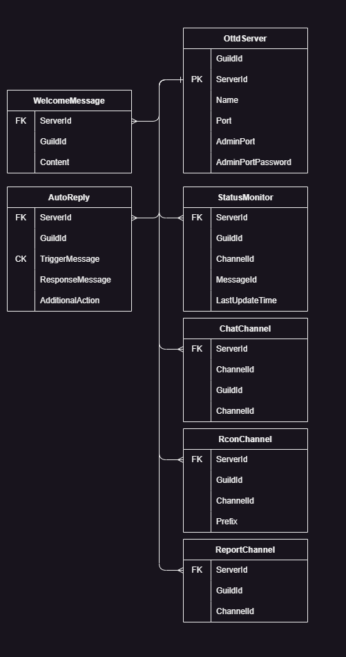

# Openttd Discord


Provides ability to integrate Discord with your OpenTTD servers.

## Functionalities

* Connects Discord channel to the Openttd Servers enabling communication between multiple servers and Discord.
    * Automatically translates ASCII emojis into Discord emojis and vice-versa.
* Ability to execute rcon commands on server from Discord.
* Ability to gather short reports from players about malicious behavior of other players
    * Contains information about connected clients
    * Contains last chat messages
    * Contains reason for the report
    * Some additional information
* Creating auto-updated messages which can show status of current server.
It contains the same information as OpenTTD client on server browser screen.

## Compilation/Installation

* load discord bot token into environment variable `ottd_discord_token`
* Use `run.sh` in order to run bot. (Use `run.pi.sh` if you are using raspberry pi.)
    * Bot automatically creates persistent SQL database on the computer where bot is being run.


* Debugging process is the same excluding the fact that you need to launch your project instead of docker instance. 
It should work out of the box with environment variables set. Remember to load MySql connection string into `ottd_discord_connectionstring` before debugging.
  * Database creation process is described inside [OpenttdDiscord.Database](https://github.com/shoter/OpenttdDiscord/tree/master/OpenttdDiscord.Database)
  * example: `Server=1.2.3.256;User ID=openttd;Password=yoursupersecretpassword;Database=openttd`


## Bots required permissions

- View channels
- Send Messages
- Embed files

Read more about permissions in [official Discord documentation](https://discord.com/developers/docs/topics/permissions)


## Usage Overview

[](https://www.youtube.com/watch?v=He2qtUTibV0)


## Usage

### Registering server(s)

ℹ️This is first step of using OpenttdDiscord bot. By registering server you will specify it's name that you will use
later to refer to it. Additionally server name will be used to distinguish from which server players are writing.

⚠️If you do not intend to use admin port functionalities then specify 0 as a port for example.
Currently only non-admin port functionality is `subscribe_server` command.

```
@BotMention register_server IP Admin_port ServerName
ServerName needs to be without spaces.
```


### Changing password of server

ℹ Used to change password for given server. Please provide *Admin Port* password when bot asks for it in DM.

⚠ Specifying password is essential for most functionalities to work properly.

```
@BotMention change_password ServerName
```

### Chat Integration

#### Registering server on discord channel

ℹ By using this command you will register this server on given channel.
Every chat message that will be written on this channel will be sent to Discord and other servers registered on this channel.
Every discord message written here will be sent to the server.

```
@BotMention register_chat_server ServerName
```

#### Unregistering server on discord channel

```
@BotMention unregister_chat_server ServerName
```

#### Listing chat servers registered on given guild

```
@BotMention list_chat_servers
```

### Admin Channels

ℹ  They are used to send rcon commands to the server.

⚠ Only one server can be registered per discord channel for admin purposes.

❗️You should register admin channels only on discord channels to which moderators/admins of your server have access to.
There is no role check when it comes to executing rcon commands as of now. It's very easy to use it maliciously if someone
have access to the channel with wrong intentions.

#### Registering admin channel.

ℹ Will register admin channel with given `prefix`. 
Every message that is preceded with `prefix` will be treated as rcon command (prefix will be removed from rcon command).
Messages without `prefix` will be ignored

```
@BotMention register_admin_channel ServerName prefix
```

#### Changing prefix

```
@BotMention ChangePrefix newPrefix 
```

#### Remove admin channel.

```
@BotMention unregister_admin_channel
```

#### List admin channels for current guild.

```
@BotMention list_admin_channels
```


### Report channels

ℹ  They activate report functionality for given server. 
Every user that will write precede his message on server with `!report` will generate report with last chat messages along with
some additional information and it will be uploaded as a file on discord channel.

ℹ  Multiple servers per channel are allowed.

#### Registering report channel

```
@BotMention register_report_channel serverName
```


### Subscription to basic server info

⚠ Port that is specified here is a TCP port used to normally connect to the game. This is **not** admin port.

```
@BotMention subscribe_server ServerName Port
```

ℹ It will create following message that will be updated every minute.
 


#### Unsubscribe server


```
@BotMention unsubscribe_server ServerName
```

#### List subscribed servers on this guild

```
@BotMention list_subscribed_servers
```

## Architecture

### Actors hierarchy


### Database diagram

