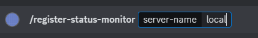
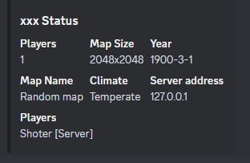
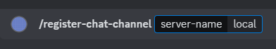
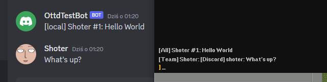

# Quick start

In this guide we are going to establish connection to the server, create server status message and chat channel connected with our server.

## Steps

- Register openttd server

- Create status message for the server

- Status message command result:

- Designate given guild channel as ottd server chat channel by executing following command on it:

- result

